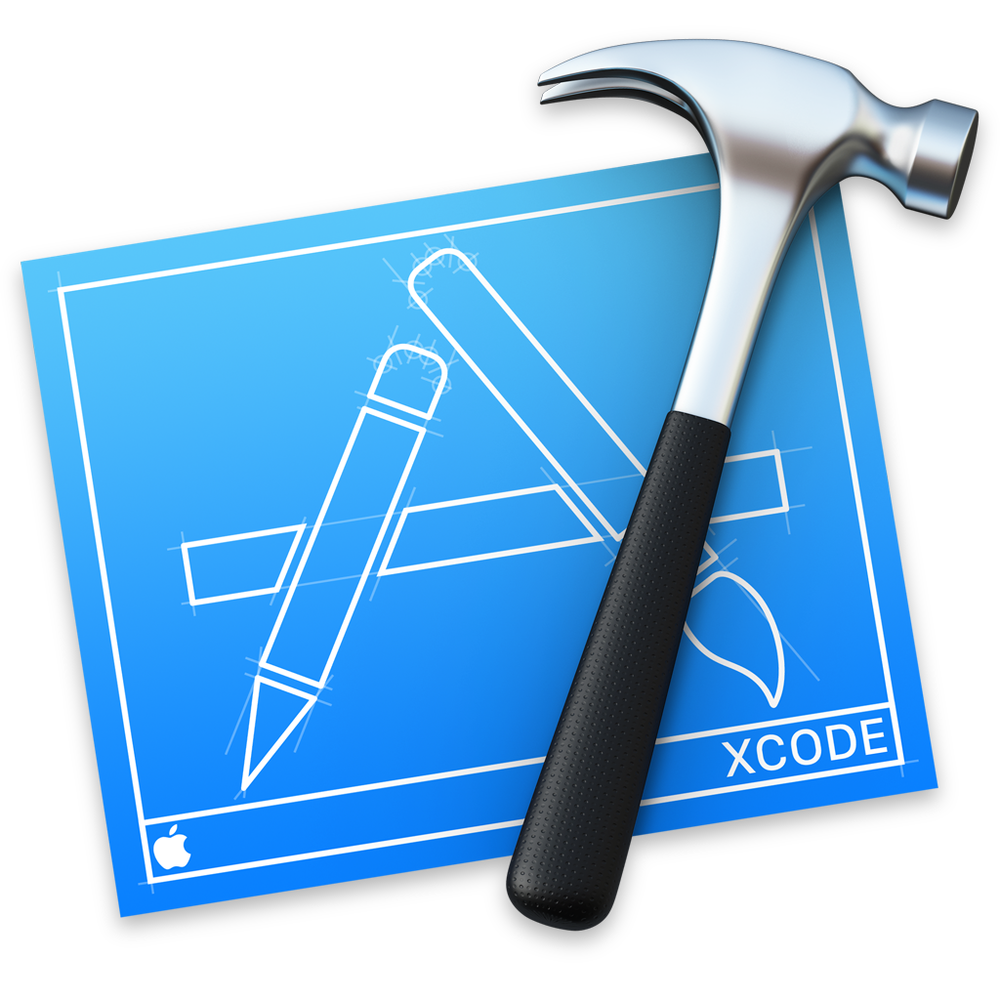

# Hi

---

## Marco Sero

### @marcosero

---


#[fit] Microsoft

---


#  
#  
#  
# [fit] iOS @ Yammer

---


# [fit] WORKING ON A
# [fit] LEGACY APP

---


# [fit] DEFINITION OF
# [fit] LEGACY

---


> "Anything *handed down from the past*, as from an ancestor or predecessor"

---


> "Obsolete"

---

# [fit] DEFINITION OF
# [fit] LEGACY CODE

---


# [fit] No Unit Tests

---


# Still used in
# [fit] Production

---


# IT JUST WORKS*
##### *most of the time

--- 


# Written in a language that you don't typically do __new__ development in

--- 


# Swift 1.2

---


# Old and complicated
# [fit] History

---


# Many 
# [fit] Contributors...

---


# [fit] ...That have all quit

--- 

## Let's recap

:heavy_check_mark: Still used in production :boom:

:heavy_check_mark: Old or deprecated language :fire:

:heavy_check_mark: Without unit tests :scream:

:heavy_check_mark: Old history with many, many contributors... :family:

:heavy_check_mark: ...most of which not around anymore :runner:

--- 


# Or whenever
# you feel like this

---


# [fit] Not much
# [fit] Legacy
# [fit] on iOS

---


## iOS development is new(ish) <br><br><br>
## Short app lifetime <br><br><br>
## Easier to re-write

---

# So why bother?

---


---


---


# [fit] JUST
# [fit] STOP
# [fit] PLEASE
# [fit] STOP

---


# <br><br><br> WHERE DO I
# START?

---

#[fit] STATS

---

# Identify the risk and start there

```bash
$ find YourApp -iname "*.h" | 
    xargs grep -h 'interface' | 
    cut -d ' ' -f 2 | 
    while read class; 
    do echo `grep -r "\b$class\b" YourApp --include "*.m" | wc -l` $class; 
    done | 
    sort -n -u
```

> from *Destroy All Software* screencasts. 

---


---


# [fit] Leverage
# [fit] git

--- 



# [fit] Git Blame 
# [fit] ⌥⌘⇧⏎

--- 


--- 


--- 


---

# [fit] git log -L 1,1:/your/file

---


#  
#  
#  
# [fit] COMMIT MESSAGES

--- 


---


---

## Your 
# [fit] COMMIT MESSAGES 
## are your
# [fit] LEGACY 

---


# [fit] \(Maybe\) DEAD
# [fit] CODE

---


# [fit] TOMBSTONES

```objectivec
- (void)possibleDeadCode
{
    // current date when tombstone was added
    log_tombstone(@"2015-08-21"); 
}
```

- Log found?
    :arrow_right: Code is alive :raising_hand:
- Log not found?
    :arrow_right: Code is dead :skull:

<br>

> From David Schnepper's Ignite talk, "Isn't That Code Dead?"

---


#  CONTINUOUS
# [fit] DESTRUCTION

---


# [fit] Inheritance

---


---

```objectivec
@implementation RootViewController
- (void)doSomething:(NSString *)aString {  }
@end

@implementation RootViewController_iPad
- (void)doSomething:(NSString *)aString {
    NSLog(@"%@ iPad", aString); 
}
@end

@implementation RootViewController_iPhone
- (void)doSomething:(NSString *)aString {
    NSLog(@"%@ iPhone", aString);
}
@end

RootViewController *vc = [[RootViewController_iPad alloc] init];
[vc doSomething:@"cool"]; // prints "cool iPad"
```

---

```objectivec
@implementation RootViewController
- (void)doSomething:(NSString *)aString {  }
@end

@implementation RootViewController_iPad
- (void)doSomething {
    NSLog(@"iPad"); 
}
@end

@implementation RootViewController_iPhone
- (void)doSomething:(NSString *)aString {
    NSLog(@"%@ iPhone", aString);
}
@end

RootViewController *vc = [[RootViewController_iPad alloc] init];
[vc doSomething:@"cool"]; // prints nothing
```

---

```swift
class RootViewController: UIViewController {
    func doSomething(aString: String) {  }
}
class RootViewController_iPad: RootViewController {
    override func doSomething(aString: String) {
        print(aString + "iPad")
    }
}
class RootViewController_iPhone: RootViewController {
    override func doSomething(aString: String) {
        print(aString + "iPhone")
    }
}
```

---

```swift
class RootViewController: UIViewController {
    func doSomething(aString: String) {  }
}
class RootViewController_iPad: RootViewController {
    override func doSomething() { // COMPILE ERROR
        print("iPad")
    }
}
class RootViewController_iPhone: RootViewController {
    override func doSomething(aString: String) {
        print(aString + "iPhone")
    }
}
```

---


> *"I've got your back"*
-- Chris Lattner on Swift's Safety

---

#[fit] THIRD-PARTY
#[fit] DEPENDENCIES

--- 


# [fit] AVOID
# [fit] THEM
### (if possible)

---

<br>
<br>
> *Build a small, but non-trivial, Rails app. [...] Go away for six months. Come back and update all of your dependencies. Your app no longer works.*
<br>
-- Gary Bernhardt

---

<br>
<br>
> *Build a small, but non-trivial, iOS app. [...] Go away for six months. Come back and update all of your dependencies. Your app no longer works.*
<br>
-- Marco Sero

---


#  
#  
#  
# [fit] FORKS

---

## Recap:

- Start identifying the risk
- Leverage Git
- Spend some time writing good commit messages
- Continuous destruction of dead code
- Avoid subclasses and touch them with care
- Third party dependencies have a cost and private forks are almost always a bad idea

---


--- -


# [fit] BE A GOOD CITIZEN

---

# HAVE FUN
# :smile::laughing::joy:

---

## Thank you.<br>

## @marcosero<br>

- *Working Effectively with Legacy Code* by **Michael Feathers**
- *Utter Disregard for Git Commit History* by **Zach Holman**
    http://zachholman.com/posts/git-commit-history/
- *Destroy All Software screencast* by **Gary Bernhardt**
    https://www.destroyallsoftware.com/screencasts
- *Isn't That Code Dead?* by **David Schnepper**
    https://www.youtube.com/watch?v=29UXzfQWOhQ

